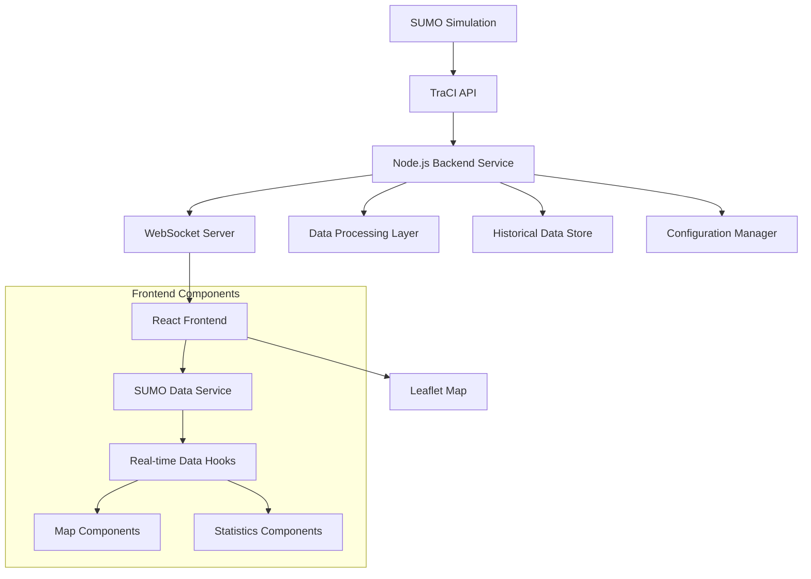

# SUMO Integration Design Document

## Overview

This design document outlines the architecture for integrating real-time SUMO (Simulation of Urban Mobility) simulation data into the existing React-based traffic management frontend. The solution will replace mock data with live simulation data through a WebSocket-based real-time communication system, implementing best practices for data streaming, error handling, and performance optimization.

The integration will leverage SUMO's TraCI (Traffic Control Interface) API through a Node.js backend service that acts as a bridge between SUMO and the React frontend, ensuring scalable and maintainable real-time data flow.

## Architecture

### High-Level Architecture



### Data Flow Architecture

1. **SUMO Simulation** generates traffic data (vehicles, intersections, roads)
2. **TraCI Interface** provides programmatic access to simulation data
3. **Backend Service** polls TraCI API and processes data
4. **WebSocket Server** streams processed data to frontend clients
5. **Frontend Service Layer** manages WebSocket connections and data state
6. **React Components** consume real-time data through custom hooks
7. **Leaflet Map** renders live traffic visualization

## Components and Interfaces

### Backend Service Components

#### 1. SUMO TraCI Client
```typescript
interface SUMOTraCIClient {
  connect(host: string, port: number): Promise<void>;
  disconnect(): Promise<void>;
  getVehicleData(): Promise<VehicleData[]>;
  getIntersectionData(): Promise<IntersectionData[]>;
  getRoadData(): Promise<RoadData[]>;
  getEmergencyVehicles(): Promise<EmergencyVehicleData[]>;
  subscribeToUpdates(callback: (data: SimulationUpdate) => void): void;
}
```

#### 2. Data Processing Service
```typescript
interface DataProcessor {
  processVehicleData(rawData: any[]): VehicleData[];
  processIntersectionData(rawData: any[]): IntersectionData[];
  processRoadData(rawData: any[]): RoadData[];
  aggregateTrafficMetrics(data: SimulationData): TrafficMetrics;
  validateData(data: any): ValidationResult;
}
```

#### 3. WebSocket Server
```typescript
interface WebSocketServer {
  start(port: number): void;
  broadcast(event: string, data: any): void;
  sendToClient(clientId: string, event: string, data: any): void;
  onClientConnect(callback: (clientId: string) => void): void;
  onClientDisconnect(callback: (clientId: string) => void): void;
}
```

### Frontend Service Components

#### 1. SUMO Data Service
```typescript
interface SUMODataService {
  connect(serverUrl: string): Promise<void>;
  disconnect(): void;
  subscribeToVehicles(callback: (vehicles: VehicleData[]) => void): () => void;
  subscribeToIntersections(callback: (intersections: IntersectionData[]) => void): () => void;
  subscribeToRoads(callback: (roads: RoadData[]) => void): () => void;
  subscribeToEmergencyVehicles(callback: (vehicles: EmergencyVehicleData[]) => void): () => void;
  getConnectionStatus(): ConnectionStatus;
}
```

#### 2. Real-time Data Hooks
```typescript
// Custom React hooks for consuming SUMO data
function useSUMOVehicles(): { vehicles: VehicleData[], loading: boolean, error: Error | null };
function useSUMOIntersections(): { intersections: IntersectionData[], loading: boolean, error: Error | null };
function useSUMORoads(): { roads: RoadData[], loading: boolean, error: Error | null };
function useSUMOEmergencyVehicles(): { emergencyVehicles: EmergencyVehicleData[], loading: boolean, error: Error | null };
function useSUMOConnection(): { status: ConnectionStatus, connect: () => void, disconnect: () => void };
```

## Data Models

### Core Data Types

```typescript
interface VehicleData {
  id: string;
  type: 'car' | 'bus' | 'truck' | 'motorcycle' | 'bicycle';
  position: {
    lat: number;
    lng: number;
    roadId: string;
    laneId: string;
  };
  speed: number; // km/h
  acceleration: number;
  angle: number; // degrees
  route: string[];
  timestamp: number;
}

interface IntersectionData {
  id: string;
  position: {
    lat: number;
    lng: number;
  };
  trafficLights: {
    phase: 'red' | 'yellow' | 'green' | 'red-yellow';
    direction: 'north-south' | 'east-west' | 'all';
    remainingTime: number;
    nextPhase: string;
  }[];
  queueLengths: {
    [laneId: string]: number;
  };
  waitingTimes: {
    [laneId: string]: number;
  };
  congestionLevel: 'low' | 'medium' | 'high';
  timestamp: number;
}

interface RoadData {
  id: string;
  coordinates: [number, number][];
  lanes: {
    id: string;
    vehicleCount: number;
    averageSpeed: number;
    density: number; // vehicles per km
    flow: number; // vehicles per hour
  }[];
  congestionLevel: 'low' | 'medium' | 'high';
  incidents: IncidentData[];
  timestamp: number;
}

interface EmergencyVehicleData extends VehicleData {
  emergencyType: 'ambulance' | 'police' | 'fire';
  priority: 'high' | 'medium' | 'low';
  status: 'responding' | 'on-scene' | 'returning' | 'available';
  destination: {
    lat: number;
    lng: number;
    description: string;
  };
  eta: number; // seconds
  route: string[];
  signalPriorityRequests: string[]; // intersection IDs
}

interface SimulationUpdate {
  timestamp: number;
  vehicles?: VehicleData[];
  intersections?: IntersectionData[];
  roads?: RoadData[];
  emergencyVehicles?: EmergencyVehicleData[];
  metrics?: TrafficMetrics;
}

interface ConnectionStatus {
  connected: boolean;
  lastUpdate: number;
  latency: number;
  reconnectAttempts: number;
  error?: string;
}
```

### Configuration Models

```typescript
interface SUMOConnectionConfig {
  host: string;
  port: number;
  updateInterval: number; // milliseconds
  reconnectInterval: number; // milliseconds
  maxReconnectAttempts: number;
  dataTypes: {
    vehicles: boolean;
    intersections: boolean;
    roads: boolean;
    emergencyVehicles: boolean;
  };
}

interface PerformanceConfig {
  maxVehiclesDisplayed: number;
  updateThrottleMs: number;
  dataRetentionHours: number;
  enableHistoricalData: boolean;
}
```

## Error Handling

### Connection Error Handling

1. **Connection Failures**
   - Implement exponential backoff for reconnection attempts
   - Display user-friendly error messages with connection status
   - Provide manual reconnection controls
   - Log detailed error information for debugging

2. **Data Validation Errors**
   - Validate all incoming data against TypeScript interfaces
   - Skip invalid data points while continuing to process valid data
   - Log validation errors for monitoring and debugging
   - Provide fallback values for critical missing data

3. **Performance Degradation**
   - Monitor update frequency and data volume
   - Implement adaptive throttling when system is overloaded
   - Provide performance metrics in development mode
   - Gracefully degrade features when necessary

### Frontend Error Boundaries

```typescript
interface ErrorBoundaryState {
  hasError: boolean;
  error?: Error;
  errorInfo?: ErrorInfo;
}

// Implement error boundaries around SUMO data components
// Provide fallback UI when real-time data fails
// Allow users to retry connection or switch to offline mode
```

## Testing Strategy

### Unit Testing

1. **Backend Services**
   - Test TraCI client connection and data retrieval
   - Test data processing and validation functions
   - Test WebSocket server event handling
   - Mock SUMO responses for consistent testing

2. **Frontend Services**
   - Test WebSocket connection management
   - Test data service subscription mechanisms
   - Test custom hooks with mock data
   - Test error handling and reconnection logic

### Integration Testing

1. **End-to-End Data Flow**
   - Test complete data pipeline from SUMO to frontend
   - Verify real-time updates and synchronization
   - Test connection failure and recovery scenarios
   - Validate data consistency across components

2. **Performance Testing**
   - Test with high-frequency data updates
   - Measure memory usage and potential leaks
   - Test with large numbers of vehicles and intersections
   - Validate smooth map interactions under load

### Mock Data Strategy

1. **Development Environment**
   - Provide comprehensive mock SUMO data for development
   - Implement mock WebSocket server for offline development
   - Create realistic traffic scenarios for testing
   - Support switching between mock and real data

2. **Testing Environment**
   - Use deterministic mock data for consistent tests
   - Implement controllable mock scenarios
   - Support edge cases and error conditions
   - Provide performance benchmarking data

## Performance Optimization

### Data Streaming Optimization

1. **Selective Data Updates**
   - Only send changed data to reduce bandwidth
   - Implement data diffing on the backend
   - Use compression for WebSocket messages
   - Batch updates for better performance

2. **Frontend Optimization**
   - Implement virtual scrolling for large vehicle lists
   - Use React.memo and useMemo for expensive calculations
   - Debounce map updates to prevent excessive re-renders
   - Implement efficient map marker clustering

3. **Memory Management**
   - Implement data cleanup for old vehicle positions
   - Use object pooling for frequently created objects
   - Monitor and prevent memory leaks in long-running sessions
   - Implement configurable data retention policies

### Scalability Considerations

1. **Backend Scalability**
   - Design for horizontal scaling with multiple SUMO instances
   - Implement load balancing for WebSocket connections
   - Use Redis for shared state across server instances
   - Support multiple concurrent frontend clients

2. **Frontend Scalability**
   - Implement progressive loading for large datasets
   - Use service workers for background data processing
   - Support multiple map views with shared data
   - Implement efficient state management with context providers