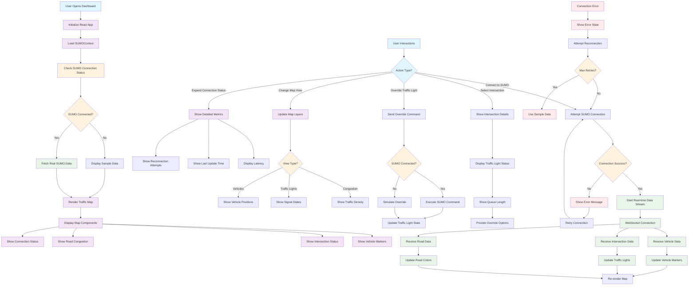
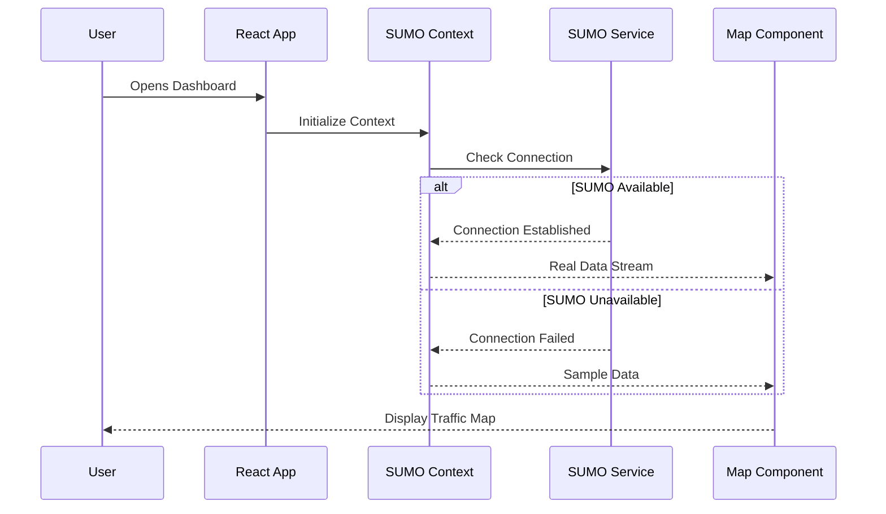
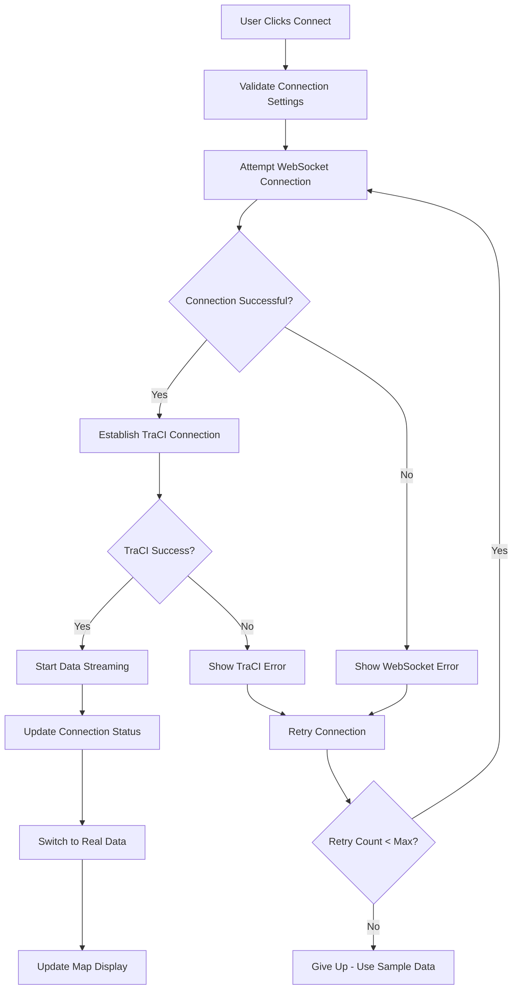
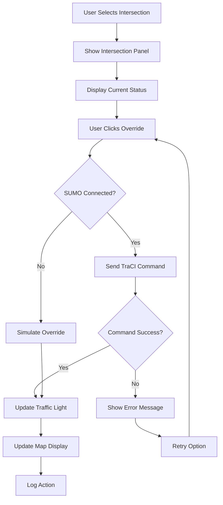
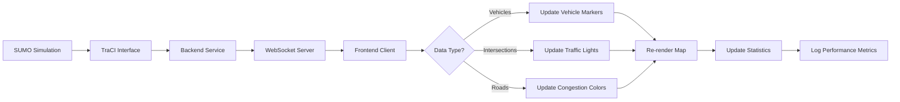
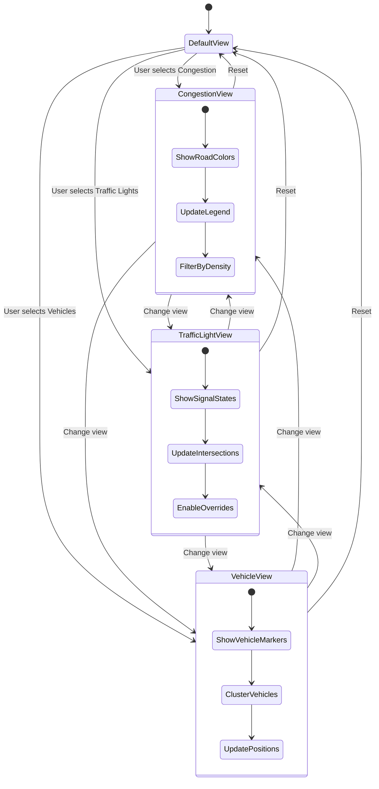
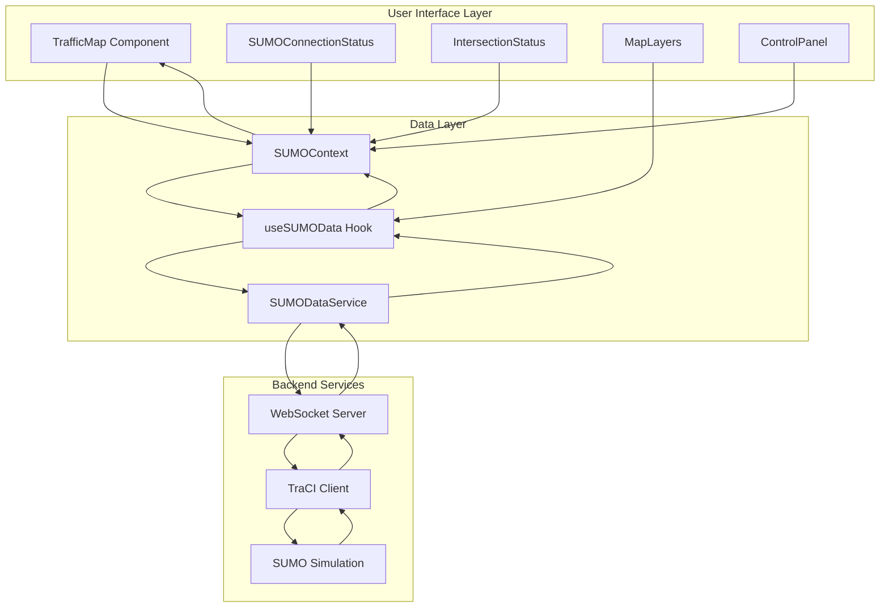
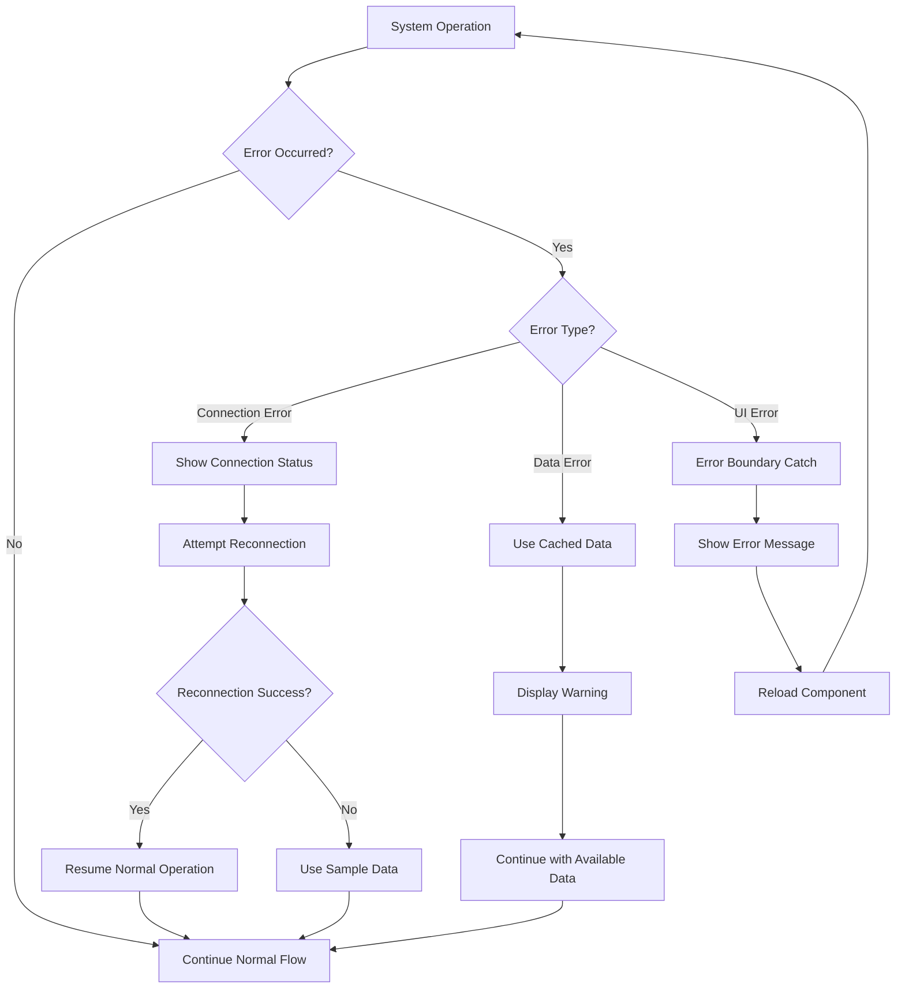

# SUMO Traffic Management Dashboard - Activity Diagram

## Main System Activity Flow

## Detailed User Journey Flows

### 1. Application Startup Flow

### 2. SUMO Connection Flow

### 3. Traffic Light Override Flow

### 4. Real-time Data Processing Flow

### 5. Map View Change Flow

## Component Interaction Activity

## Error Handling Activity Flow

This activity diagram covers:

- **Main system flow** from startup to operation
- **User interaction patterns** for all major features
- **Real-time data processing** workflows
- **Error handling and recovery** mechanisms
- **Component interactions** and data flow
- **State management** across the application

The diagrams show how users interact with the system, how data flows through the components, and how the system handles various scenarios including errors and edge cases.
